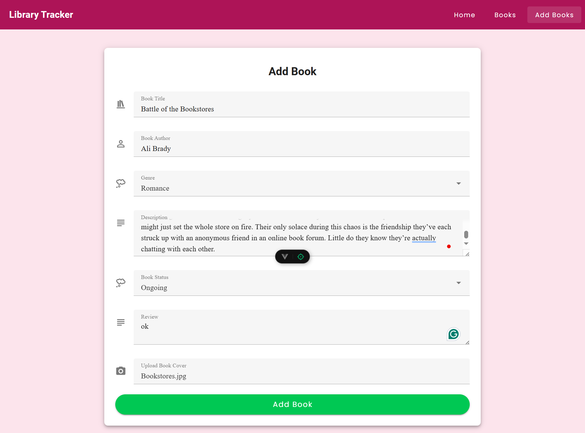
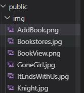

# Personal Library Tracker
Library Tracker is a web-based book management system built using **Vue 3**, **Vuetify**, **TypeScript**, and **JSON Server**. It allows users to add, browse, search, and manage their personal library.


## 🚀 Features

- Add new books with cover, description, status, review and genre
- Browse all books with title, author, and description
- Search books by title or reading status
- View book details and manage entries (edit/delete)

## 🛠️ Tech Stack

- **Vue 3** (Composition API)
- **TypeScript**
- **Vuetify 3** (UI Framework)
- **Vite** (Dev server & bundler)
- **JSON Server** (Mock backend API)
- **Vue Router** (Routing)

## Run with Docker

First launch docker and run this command 
```bash
docker-compose up --build
```
This will:

Serve the frontend on http://localhost:8080/

Serve JSON Server API on http://localhost:8080/api/books

### To stop the service: 
```bash
docker-compose down
```

## 📚 Add Book Tutorial 
### 1. Navigate to Add Book Page
### 2. Fill in the Add book Form 
   
   
###  3. Upload Book Cover as below
   
   
  ⚠️ Note: Since this project is frontend-only and doesn't use a database, uploaded images cannot be stored permanently. To ensure the image is displayed correctly, you need to upload the image into the public/img directory manually.
  
   
   
### 5. Click 'Add Book' 
  
  After filling out the form and ensuring the image exists in the correct path, click 'Add Book' to add the book.
